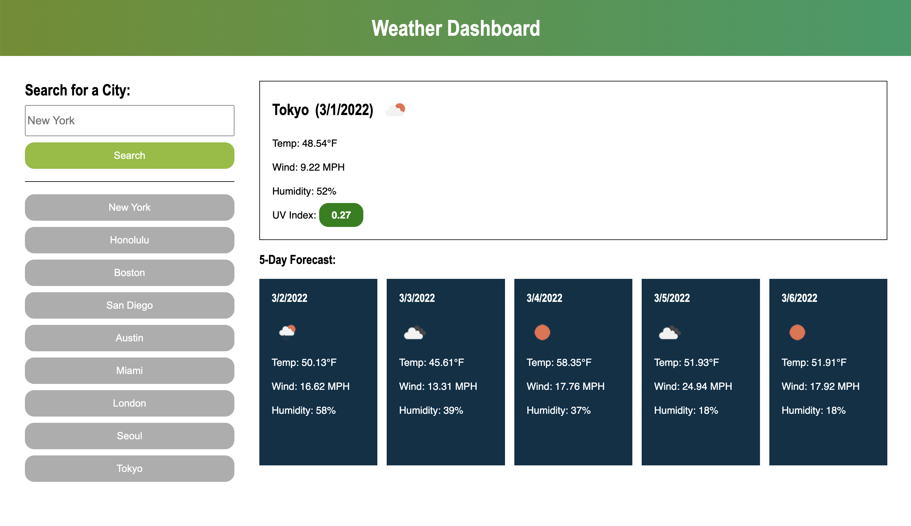

# Weather Dashboard

## Table of contents
* [Description](#description)
* [Technologies](#technologies)
* [My Steps](#my-steps)
* [Results](#results)
* [Credit](#credit)

## Description
Create an application which shows the current weather and future 5-day forecasts for multiple cities.
	
## Technologies
Project was created using:
* VS Code
* HTML
* CSS
* JavaScript
* Open Weather API
* Terminal (Mac)
* Git
* GitHub

## My Steps
### STEP 1. - SETUP
* Created GitHub Repository.
* Created a project folder with html, css, and javascript files.
* Pushed first commit of files into the new Repo using Git.
* Created a live link of my site in GitHub.

### STEP 2. - CREATE HTML FRAMEWORK
* Created various sections and divs as a framework
* Setup example elements to style in CSS.

### STEP 3. - SETUP CSS STYLES
* Styled elements on the page.
* Used flexbox to create layout and mobile responsiveness.

### STEP 4. - CREATE FUNCTIONALITY WITH JAVASCRIPT
* Created a function for the search button click event. When a search is made, the searched city is pushed into the function to get it's coordinates.
* Fetched the Open Weather API to get coordinates of the searched city. If the searched city is valid, the city is saved into local storage, appended into a button, and the coordinates are pushed into the next funciton.
* Used latitude and longitude coordinates to fetch One Call API and get weather information.
* Created a function that displays the current weather information and a loop which displays the 5-day forecast.
* Created a loop at the bottom of the page so the previously searched buttons are appended onto the page when refreshed.

### STEP 5. - FINALIZE
* Made various commits throughout process to save progress
* Tested functionality in GitHub pages

## Results

* https://github.com/etrenholm/weather-dashboard
* https://etrenholm.github.io/weather-dashboard

## Credit

Erica Trenholm: https://github.com/etrenholm

### ©️ February 2022

